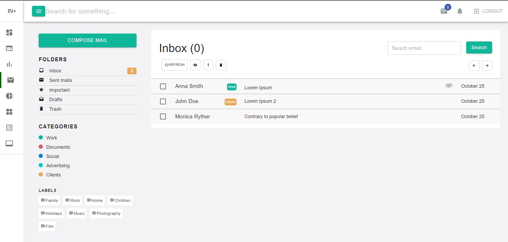
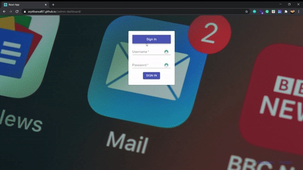

# Admin Dahboard App

A react app to create a mail dashboard.



## 🖥️ Project Demo



User Details (Username/Password):

-  john@doe.com/doeJohn
-  anna@smith.com/smithAnna

## 📋 Assumptions

- [x] Use of local storage for keeping mails.
- [x] Marking of mails as Read and delete.
- [x] Sending emails by using compose mail option.
- [x] 2 Emails have been configured as mentioned under Project demo section.

## 🛠️ Build with

This section lists any major frameworks that you built your project using.

- [React.js]

## 🚀&nbsp; Installation

Admin Dashboard App requires [Node.js](https://nodejs.org/) v12+ to run.

Install the dependencies after cloning the repo and start the server.

```sh
$ git clone https://github.com/ArpitBansal87/admin-dashboard.git
$ yarn install / npm install
$ yarn start / npm run start

```

## ⚠️&nbsp; Found a bug? Missing a specific feature?

Feel free to **file a new issue** with a respective title and description on the the [Admin Dashboard App](https://github.com/ArpitBansal87/admin-dashboard/issuess) repository. If you already found a solution to your problem, **we would love to review your pull request**!

## 🤝&nbsp; Contributions

Contributions are what make the open source community such an amazing place to be learn, inspire, and create. Any contributions you make are **greatly appreciated**.

1. Clone the Project
2. Create your Feature Branch (git checkout -b feature/AmazingFeature)
3. Commit your Changes (git commit -m 'Add some AmazingFeature')
4. Push to the Branch (git push origin feature/AmazingFeature)
5. Open a Pull Request

[react.js]: https://reactjs.org/
[deployment-link]: https://www.npmjs.com/package/
